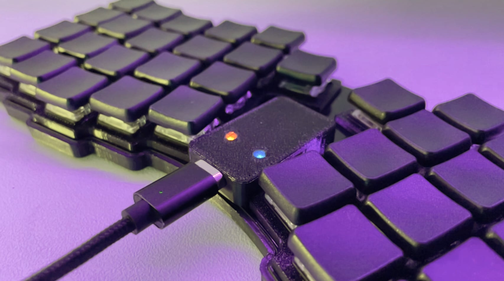

# Atreus

## Description

A keyboard with 42 key [Atreus](https://atreus.technomancy.us) layout. Uses [Kailh Choc](http://www.kailh.com/en/Products/Ks/CS/) low profile switches with hot-swap sockets. Compatible with ProMicro type controllers, but designed to be used with [Nice!Nano](https://nicekeyboards.com/nice-nano). Capable of n-key rollover.

## Materials

| Name            | Part         | Size    | Amount |
| --------------- | ------------ | ------- | ------ |
| Switch          | CPG135001D0X |         | 42     |
| Socket          | CPG135001S30 |         | 42     |
| Diode           | 1N4148       | SOD123  | 42     |
| Controller      | nice!nano    |         | 1      |
| Battery         | XZK          | 301230  | 1      |
| Bolt            | M2 Hex       | 4mm     | 8      |
| Machine Headers | Mill-Max     | 13p 3mm | 2      |

## Build

### PCB

- For every switch has a diode, soldered where an LED would normally be located, providing n-key rollover.
- ⚠️ No power switch for the battery

### Sockets

- The PCB has 1.5mm wide holes for mounting the controller socket. This allows soldering machine headers flush with the board. The nice!nano controller originally ships with low profile headers, which won't fit the battery underneath the controller, if soldered in this manner. Therefore a pair of 3mm tall headers had to be separately ordered.

### Case

- All 3d printing was done with 0.4mm nozzle at 0.2mm layer height from PETG.
- The bottom case is attached using eight 4mm long M2 bolts.
- Added feet using 1mm thick rubber tape

### Leds

- There are two openings controller's LEDs. They can be filled with a dab of hot-glue before the print is removed form the bed to get a more diffused look *...for science, you monster.*