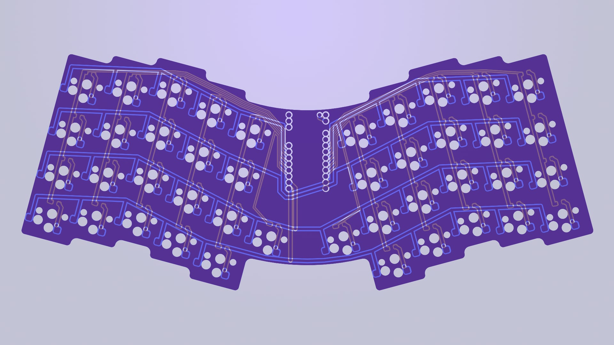
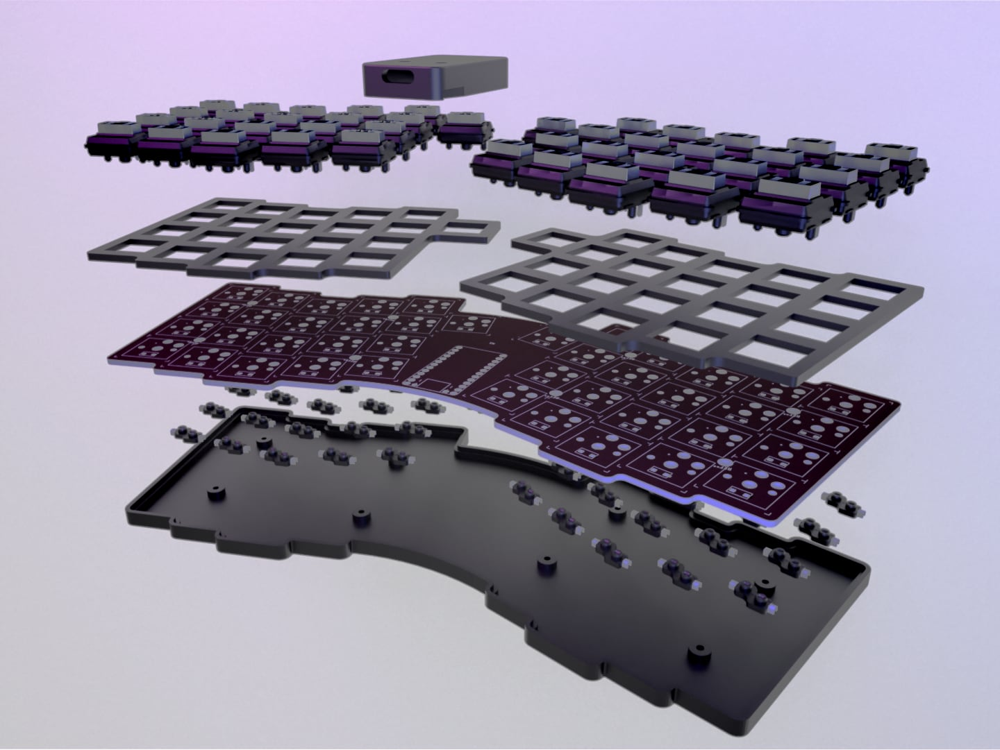
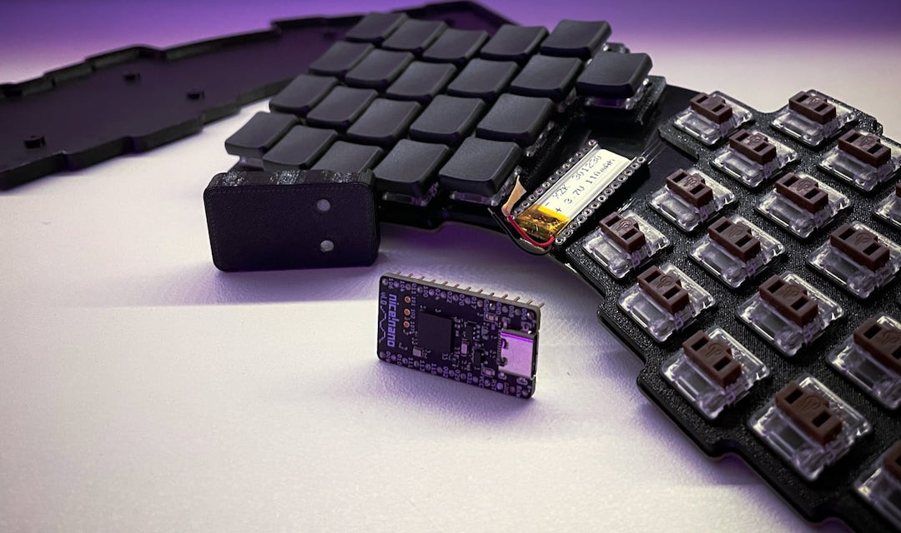
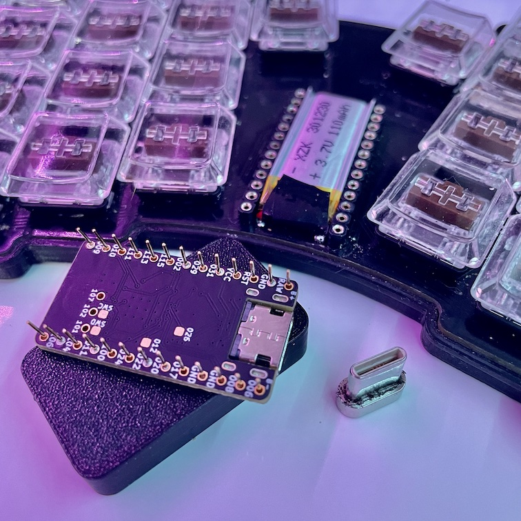

# Atreus

### Description
A keyboard with 42 key [Atreus](https://atreus.technomancy.us) layout. Uses [Kailh Choc](http://www.kailh.com/en/Products/Ks/CS/) low profile switches with hot-swap sockets. Compatible with ProMicro type controllers, but designed to be used with [Nice!Nano](https://nicekeyboards.com/nice-nano). Capable of n-key rollover.

### Build
There is gerber files for the PCB and STL models for the case in the export folder.

It uses **3mm tall machine pin headers** to create space for **301230 battery**. The holes in the PCB are enlarged to allow the headers to sit flush with the board. I've also soldered a reset button directly on top of Nice!Nano's pins.

For every switch there is a **1N4148** diode in a **SOD123** package. Diodes are soldered where an LED would normally be located, as the board has no lighting of any sort. Although can diodes be soldered by hand, a hot-air gun definitely makes task easier.

The bottom case is attached using eight 4mm long (excluding head) M2 bolts.
I've attached some rubber feet as well to keep it from sliding around.

Few things to note:
- There is no battery disconnect switch. In my case it's fine since the controller is quite energy efficient.
- 3D Model for the case does not have any tolerance included so depending on your printer settings I can be a potentially tight fit.
- Although the controller shipped with included pin headers, but they where not tall enough to fit the battery when soldered flush with the board.

### Images

